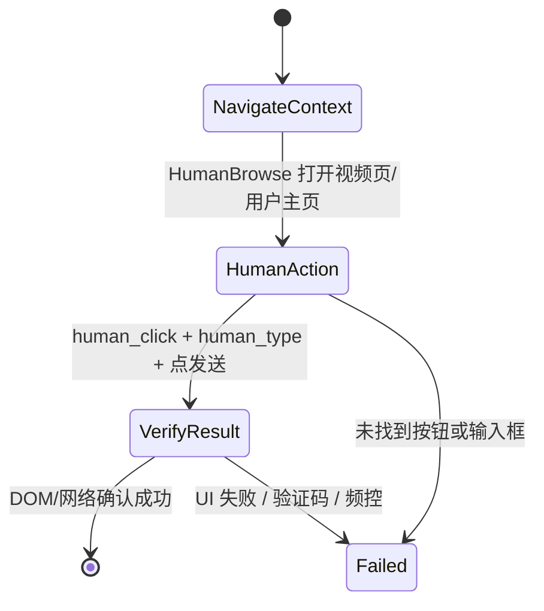
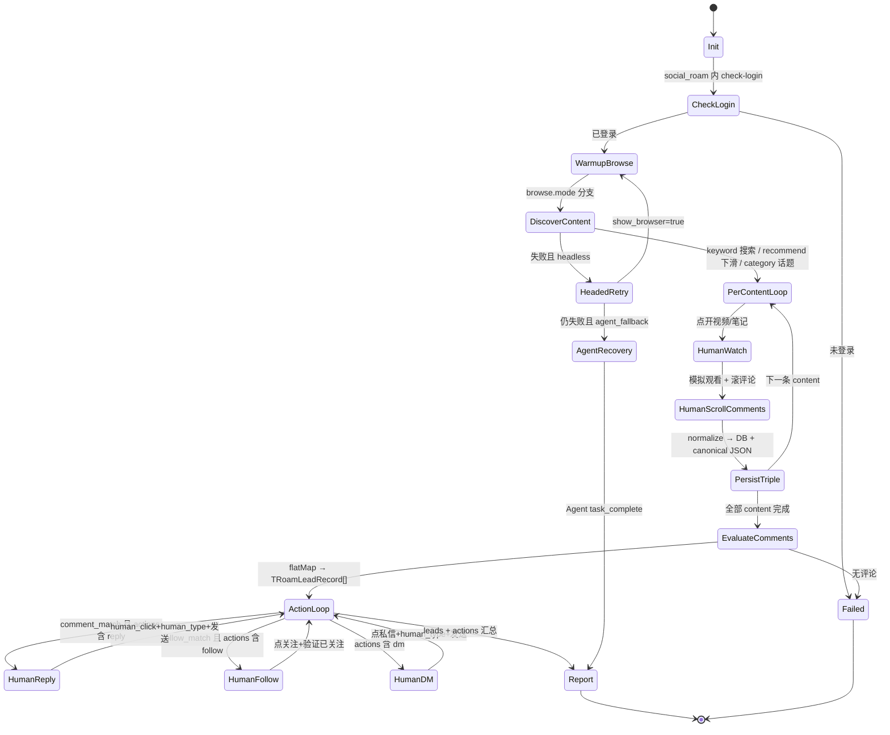

# 浏览器漫游 Skill 设计文档

> 版本：v0.6（设计稿）  
> 日期：2026-06-12  
> 状态：待评审 → 实现  
> 变更：v0.6 补充 **interaction_logs 动作台账** + **Phase 0 零代码 Agent 查库精准日播**

---

## 1. 背景与目标

### 1.1 需求描述

开发一个 **浏览器漫游 Skill**，在有头（headed）或无头（headless）模式下，根据用户输入的自然语言或结构化指令，自动完成社交平台上的完整获客链路：

| 能力 | 说明 |
|------|------|
| **人工仿真浏览** | 真实 Chrome + 预热/滚动/点击/输入/停留，行为节奏与真人一致 |
| **人工仿真互动** | 回复/关注/私信同样走页面点击 + 逐字输入 + 发送，**禁止**跳过 UI 直接裸调 API（可作兜底） |
| 搜索 | 从平台首页/热榜/探索页进入搜索框，**禁止**裸跳搜索 URL |
| 浏览 | 逐条点开视频/笔记，模拟观看时长，滚动评论区 |
| 读评论 | 滚动评论面板触发接口，完整采集评论列表 |
| **三元采集** | 每条线索同时落库：**视频信息 + 评论信息 + 评论用户信息**（含内容作者） |
| 筛选评论 | 按规则判断评论是否符合跟进条件 |
| 回复评论 | 对符合条件的评论发送回复 |
| 关注用户 | **独立条件** `follow_match`；可与回复条件不同 |
| 私信用户 | 向目标用户发送私信 |
| **日播获客** | 定时任务 + 配额；单租户长驻浏览器（见 §6.4–6.5） |
| **DB 精准任务** | 查库知「抓多少/待跟进/已回复」；`interaction_logs` 硬去重（见 §6.7–6.9） |

### 1.2 非目标（v1 不做）

- **不修改**现有 builtin 的行为（`reply-comment`、`follow-user`、`send-dm`、`*-keyword-comments`、`pipeline-*` 等保持原实现）
- **不给**原有 Skill 增加 `interaction_mode` 或切换默认逻辑
- 不替代原有 Agent/REST/Pipeline 生产链路
- 不做跨平台统一 DOM 选择器（各平台 UI 差异大）
- 不做批量无限制刷量（需配额与频控）
- 不绕过登录墙/验证码（遇阻 `task_failed`，人工介入）

### 1.3 双轨制：原有 Skill vs social-roam（核心边界）

| 维度 | **原有 Skill / 方法（保持不变）** | **social-roam（新增，全人工）** |
|------|----------------------------------|----------------------------------|
| Skill ID | `reply-comment`、`follow-user`、`send-dm`、`search-content`、`*-keyword-comments`、`pipeline-keyword-video-comments` 等 | **`social-roam`** / `pipeline-social-roam` |
| builtin_handler | `reply_comment`、`follow_user`、`send_dm`、`crawl_keyword_comments` 等 | **`social_roam`**（新 handler） |
| 执行代码 | `backend/app/platforms/{platform}/reply_comment.py` 等**现有文件** | **`backend/app/services/social_roam/human/{platform}/`** 全新模块 |
| 读路径 | 现有搜索/抓评（含部分 human_type，以各平台现状为准） | 强制全链路 `human_*`（预热/点击/滚动/观看） |
| 写路径 | 抖音/快手/小红书：**JS API / GraphQL 为主**；xhs 回复 API→UI 兜底；dm 部分 UI+fill | **仅 UI**：`human_click` + `human_type` + 点发送 |
| Agent 规则 | 现有系统提示：写入走 invoke 原 builtin，禁止 browser 拼流程 | 仅当用户/任务 **显式 invoke social-roam** 时走人工链路 |
| REST / Pipeline | 现有 Open API、Pipeline 接口**不变** | 新增可选 `/social-roam` 或 Agent 任务类型 |
| 数据入库 | 共用 `content_comments` + canonical JSON | 同上（复用 `CommentStoreService`，不另建表） |

```
                    ┌─────────────────────────────────────┐
                    │         Agent / REST / UI            │
                    └──────────────┬──────────────────────┘
                                   │
              ┌────────────────────┴────────────────────┐
              │                                         │
              ▼                                         ▼
   ┌──────────────────────┐              ┌──────────────────────────┐
   │  原有 builtin 链路     │              │  social-roam 链路（新）    │
   │  （模式不变）          │              │  （完全模拟人工）          │
   ├──────────────────────┤              ├──────────────────────────┤
   │ reply-comment        │              │ social_roam handler      │
   │ follow-user          │              │   → human/browse         │
   │ send-dm              │              │   → human/reply          │
   │ *-keyword-comments   │              │   → human/follow         │
   │ pipeline-*           │              │   → human/dm             │
   └──────────┬───────────┘              └────────────┬─────────────┘
              │                                       │
              ▼                                       ▼
   platforms/*/reply_comment.py          social_roam/human/*/（新代码）
   platforms/*/follow.py                 不调用原有 reply/follow/dm Tool
   …现有实现不变…
```

**结论**：social-roam 是**平行新增**的一条 Skill 链路，不是对原有 Skill 的升级或参数开关。

### 1.4 与现有架构的关系

项目已具备清晰三层：

```
┌─────────────────────────────────────────────────────────┐
│  Agent / REST / Pipeline                                 │
│  （理解指令、编排、汇报）                                  │
├─────────────────────────────────────────────────────────┤
│  Skill 层                                                │
│  builtin │ instruction │ actions                         │
├─────────────────────────────────────────────────────────┤
│  BrowserRuntime（browser_* 工具）                        │
│  Chrome + 人类延迟 + XHR 拦截                             │
└─────────────────────────────────────────────────────────┘
         ↓ 平台实现
  douyin │ xiaohongshu │ kuaishou  (backend/app/platforms/)   ← 原有，不改
              +
  social_roam/human/{platform}/                             ← 新增，仅 social-roam 使用
```

**结论**：见 §1.3 双轨制；原有方法与 social-roam **代码隔离、行为隔离**。

---

## 2. 人工仿真（仅 social-roam 链路）

> 本章所有原则**仅适用于 social-roam**；原有 Skill 不受本章约束。

### 2.1 设计目标

social-roam 的「完全模拟人工操作」指：**读与写**均在持久化 Chrome Profile 中，按真人节奏完成页面旅程。

- **读**：搜索、看视频、滚评论 → 触发接口并采集三元数据
- **写**：点回复、点关注、开私信、逐字输入、点发送 → 与真人操作路径一致

**禁止**在本链路中使用「跳过 UI 直接 post_form / GraphQL」作为主路径（与原有 `reply_comment.py` 等方法 deliberately 分离）。

### 2.2 统一人工行为清单（读 + 写）

| 阶段 | 人工动作 | 底层实现 | 说明 |
|------|----------|----------|------|
| 会话启动 | 打开首页、随机停留 | `browser_warmup` / crawler entry_url | 无头/有头均执行 |
| 搜索 | 点击搜索框 → 逐字输入 → 回车/点搜索 | `human_type` + `human_click` | 抖音禁 `goto /search/` |
| 结果浏览 | 滚动列表、停顿、偶尔回滚 | `human_scroll` + `human_delay` | 触发 search/list 接口 |
| 打开内容 | 点击缩略图/标题进入详情 | `human_click` | 优先点击，少裸 `goto` |
| 模拟观看 | 停留 3–15s（可配置） | `human_delay(profile="watch")` | 触发播放/曝光 |
| 读评论 | 滚到评论区、多次下滚 | `human_scroll` + 等 `comment/*` API | 不一次性 fetch 全量 |
| **回复评论** | 滚到目标评 → 点「回复」→ 聚焦输入框 → **逐字输入** → 点「发送」 | `human_click` + `human_type` + 等 post 响应 | 见 §2.6 |
| **关注用户** | 进主页/点头像 → 点「关注」→ 等按钮变「已关注」 | `human_click` + `human_delay` | 见 §2.6 |
| **私信用户** | 进主页 → 点「私信」→ 等弹层 → **逐字输入** → 回车/点发送 | `human_click` + `human_type` | 抖音/快手已有 UI 雏形，需升级 human_* |
| 看用户 | 可选点开评论者头像/主页 | `human_click` + 短停留 | 补全 user 资料 |

### 2.3 有头 / 无头与人工仿真

| 模式 | 人工仿真 | 差异 |
|------|----------|------|
| 无头 `show_browser=false` | ✅ 同样执行 delay/scroll/click | 无 GUI，适合批量 |
| 有头 `show_browser=true` | ✅ 同上 | 便于调试、过反爬 |
| `headless_fallback` | T0 无头失败 → T1 有头 | 参数不变，只改 headless |

**要点**：无头不等于「API 爬虫」；无头仍是 Playwright 真 Chrome，只是不显示窗口。

### 2.4 参数扩展

```typescript
human_simulation?: {
  enabled: boolean;              // 默认 true
  warmup_before_search?: boolean;
  watch_seconds_min?: number;
  watch_seconds_max?: number;
  scroll_rounds_per_content?: number;
  comment_scroll_rounds?: number;
  delay_profile?: "fast" | "normal" | "cautious";
  min_seconds_between_writes?: number;  // 默认 8
  verify_after_write?: boolean;       // 默认 true
};
```

> social-roam **无** `interaction_mode` / `js_api` 开关——本 Skill 只有人工一种模式；失败即 `task_failed`，不回退到原有 JS API 链路。

### 2.5 写路径人工仿真（social-roam 专用）

#### 2.5.1 写操作状态机（无 API 兜底）



#### 2.5.2 各平台写操作（新模块实现）

| 动作 | 实现位置（新代码） | 可参考（只读，不修改） |
|------|-------------------|------------------------|
| **回复** | `social_roam/human/{platform}/reply.py` | xhs `_reply_via_ui` 的 selector 思路 |
| **关注** | `social_roam/human/{platform}/follow.py` | 原有 `follow.py` 的主页打开逻辑 |
| **私信** | `social_roam/human/{platform}/dm.py` | 原有 `dm.py` 的按钮 selector |
| **搜索+浏览** | `social_roam/human/{platform}/browse.py` | 原有 `search.py` / `comment_tool.py` |

#### 2.5.3 人工写操作规范（三平台共用）

1. **定位**：先用 DB/`comment_id` 定位内容 URL，**禁止**在列表里翻页找评论（与现规则一致）
2. **滚动**：`human_scroll` 滚到目标评论/按钮入视口
3. **点击**：`human_click` 点回复/关注/私信（禁止 `force=True` 除非 retry）
4. **输入**：`human_type` 逐字输入（禁止 `locator.fill` 一次性灌入）
5. **提交**：`human_click` 点发送，或 `keyboard.press("Enter")` 前加 `human_delay`
6. **验证**：等 network 响应或 DOM 出现新评论/「已关注」/消息气泡
7. **频控**：两次写操作之间 `human_delay(profile="action")`，可配置最小间隔秒数

7. **频控**：两次写操作之间 `human_delay(profile="action")`

#### 2.5.4 与 Agent / 原有 Skill 的关系

| 场景 | 应使用的 Skill | 写路径模式 |
|------|----------------|------------|
| 日常 Agent「回复这条评论」 | `reply-comment` | **原有** JS API / 现有 xhs 混合 |
| 日常 Pipeline 抓评论 | `pipeline-keyword-video-comments` | **原有**，无写操作 |
| 用户要求「像真人一样漫游获客」 | **`social-roam`** | **全人工** UI |
| 用户未指定 | 默认 **原有** Skill | 不变 |

- social-roam 任务：Agent **只 invoke `social-roam`**，内部走 human 模块；**不要**再 invoke `reply-comment` 等原 Skill
- 原有任务：继续 invoke 原 Skill；**禁止**为省事改调 social-roam
- Agent 仍禁止裸 `browser_*` 拼流程；social-roam 的 human 逻辑全部在 handler 内

### 2.6 原有实现对照（只读参考，不修改）

| 原有模块 | 原有模式 | social-roam 新模块 |
|----------|----------|-------------------|
| `douyin/reply_comment.py` | JS `post_form_via_page` | `social_roam/human/douyin/reply.py` |
| `douyin/follow.py` | JS POST follow | `social_roam/human/douyin/follow.py` |
| `douyin/dm.py` | UI + `.fill` | `social_roam/human/douyin/dm.py`（human_type） |
| `xiaohongshu/reply_comment.py` | API → UI 兜底 | `social_roam/human/xiaohongshu/reply.py`（仅 UI） |
| `kuaishou/reply_comment.py` | GraphQL | `social_roam/human/kuaishou/reply.py` |

### 2.7 规则对照

| 操作 | social-roam | 原有 Agent / REST |
|------|-------------|-------------------|
| 读（搜索/滚评） | human_* 专用 browse 模块 | 原 keyword-comments 等 |
| 写（回复/关注/私信） | human 模块内 UI | 原 reply/follow/dm Tool |
| 失败兜底 | task_failed（不调原 Skill） | 原 show_browser 重试 / Pipeline Recovery |
| 裸 browser 拼流程 | ❌ | ❌ |

---

## 3. 三元数据采集（视频 + 评论 + 用户）

### 3.1 采集目标

漫游过程中，**每一条评论**必须能关联到完整上下文，供筛选、回复、跟进和导出：

```
TRoamLeadRecord
├── content（视频/笔记）
├── comment（评论）
├── comment_user（评论作者）
└── content_author（内容发布者，可选单独字段）
```

### 3.2 统一输出 Schema

```typescript
/** 单条漫游线索 — social-roam 报告与 DB 对齐 */
type TRoamLeadRecord = {
  /** 关联键 */
  platform: "douyin" | "xiaohongshu" | "kuaishou";
  task_id: string;
  keyword: string;

  /** 视频 / 笔记 */
  content: {
    content_id: string;           // aweme_id / note_id / photo_id
    content_url: string;
    title?: string;
    description?: string;
    cover_url?: string;
    publish_time?: number;        // Unix 秒
    like_count?: number;
    comment_count?: number;
    share_count?: number;
    capture_method?: string;      // thin_js_api / network_capture / ...
    keyword_context?: {
      keyword: string;
      days?: number;
      region?: string;
    };
  };

  /** 内容发布者 */
  content_author?: {
    user_id?: string;
    sec_uid?: string;             // 抖音
    nickname?: string;
    avatar?: string;
  };

  /** 评论 */
  comment: {
    comment_id: string;
    parent_comment_id?: string;
    text: string;
    create_time?: number;
    digg_count?: number;
    reply_comment_total?: number;
  };

  /** 评论作者 */
  comment_user: {
    user_id?: string;
    sec_uid?: string;
    nickname: string;
    avatar?: string;
    /** 快手回复/私信常用 */
    reply_to_user_id?: string;
  };

  /** 平台扩展 — 原始 API 片段，入库 raw_data */
  raw?: Record<string, unknown>;

  /** 匹配与动作结果 */
  matched?: boolean;
  match_reason?: string;
  actions_taken?: Array<{ type: string; status: string; error?: string }>;
};
```

### 3.3 与现有存储的映射

| TRoamLeadRecord 字段 | MySQL `content_comments` | JSON canonical 文件 | 备注 |
|----------------------|--------------------------|---------------------|------|
| `content.content_id` | `content_id` | `aweme_id` / `note_id` | 已有 |
| `content.content_url` | `content_url` | `video_url` / `note_url` | 已有 |
| `comment.*` | 列 + `raw_data` | `comments[]` | 已有 |
| `comment_user.user_id` | `raw_data.user_id` | `comments[].user_id` | 已有，在 raw |
| `comment_user.sec_uid` | `raw_data.sec_uid` | 同左 | 抖音必需 |
| `content.title` 等 | ❌ 无独立内容表 | canonical 顶层 meta | **缺口：需扩展** |
| `content_author` | ❌ | `raw_data` / meta | **缺口：需扩展** |

**v1 策略**：

1. 评论与用户：继续 `CommentStoreService.merge_and_persist`，用户 ID 写入 `raw_data`（与 `normalize_comment` 一致）。
2. 视频 meta：写入 canonical JSON 顶层 + 新增 **`content_snapshots`** 内存结构；Phase 2 可选落库 `stored_contents` 表。
3. social-roam 报告：输出 `leads: TRoamLeadRecord[]`，每条评论一行，**强制带齐** `content` + `comment` + `comment_user`。

### 3.4 各平台字段来源

| 字段 | 抖音 | 小红书 | 快手 |
|------|------|--------|------|
| content_id | `aweme_id` | `note_id` | `photo_id` |
| 评论列表 API | `comment/list` | `comment/page` | 页面 JS |
| user_id | `user.uid` | `user.user_id` | `authorId` |
| sec_uid | `user.sec_uid` | — | — |
| photo_author_id | — | — | 视频作者，回复必填 |
| 视频 title/desc | search/item 或详情 API | search/notes | 搜索 API |

平台 adapter 在 `keyword-comments` 返回的每条 result 中应已含 `title`、`author`、`comments[]`；social-roam **归一化为 TRoamLeadRecord**，缺失字段标记 `collect_status: partial` 并触发补抓 `content-comments`。

### 3.5 采集流程（与状态机衔接）

```
对每个 content（视频/笔记）:
  1. 人工仿真打开详情 + 滚动评论区
  2. 拦截/解析 API → normalize_comment（含 user 块）
  3. merge_and_persist → DB + canonical JSON
  4. 从 search result 补全 content meta + content_author
  5. flatMap comments → TRoamLeadRecord[]
  6. comment_match 筛选 → actions_on_match
  7. 报告汇总 leads + matched + actions
```

### 3.6 导出与前端展示

- **API 响应**：`{ leads, summary, output_files, db_content_ids }`
- **CommentUserView / 获客 UI**：按 `content_id` 分组展示视频卡片，下挂评论与用户头像/昵称/ID
- **CSV 导出**（Phase 3）：列 = 关键词、视频标题、视频链接、评论、评论者、user_id、是否已回复

---

## 4. 核心设计决策：是否需要按平台独立 Skill？

### 4.1 结论摘要

| 层级 | 是否独立 | 形式 | 原因 |
|------|----------|------|------|
| **编排入口** | ❌ 一个全局 Skill | `social-roam` | 与原有 Skill **并列**，非替代 |
| **执行代码** | ✅ 平台 human 子模块 | `social_roam/human/{platform}/` | **新目录**；不扩展现有 platform Tool |
| **原有原子 Skill** | ❌ social-roam **不调用** | `reply-comment` 等照旧服务 Agent/REST | 双轨并存 |
| **Recovery 指南** | ✅ 平台 instruction 附录 | `platforms/douyin-roam.md` 等 | 仅 social-roam Recovery 使用 |

**不需要**为每个平台各做一个完整的「漫游 Skill 副本」；需要 **1 个编排 Skill + N 份平台 Profile（参考文档/规则）**。

### 4.2 平台差异矩阵

| 维度 | 抖音 | 小红书 | 快手 |
|------|------|--------|------|
| 内容形态 | 短视频 | 图文/视频笔记 | 短视频 |
| 搜索入口 | 热榜→搜索框 | 探索页预热→搜索 | 首页搜索 |
| **原 Skill 回复** | JS API | API→UI 兜底 | GraphQL |
| **social-roam 回复** | UI human_type | UI human_type | UI human_type |
| 私信 PC | 原/UI 混合 | ❌ | 原/UI 混合 |
| 用户 ID | sec_uid + user_id | user_id | user_id + photo_author_id |

social-roam 的 platform 差异在 **`social_roam/human/{platform}/`** 内实现；`backend/app/platforms/` **保持不动**。

---

## 5. Skill 体系设计

### 5.1 Skill 清单（建议新增）

#### A. 主编排 Skill（必选）

```yaml
id: social-roam
name: 社交平台漫游获客
type: builtin                    # 推荐：可预测、可测试
builtin_handler: social_roam     # 新增 handler
scope: global
```

**职责**：解析任务 → **自有** human 模块执行读+写 → 三元采集 → 匹配 → 写操作 → `leads[]` 报告。  
**不调用** `reply-comment` / `follow-user` / `send-dm` / `*-keyword-comments` 等原 Skill。

#### B. Pipeline 别名（可选，对外 API 友好）

```yaml
id: pipeline-social-roam
builtin_handler: social_roam     # 与 social-roam 同一 handler
description: T0 无头 → T1 有头重试 → T2 Agent Recovery
```

与现有 `pipeline-keyword-video-comments` 模式一致。

#### C. Agent Instruction Skill（Recovery 专用）

```yaml
id: social-roam-recovery
type: instruction
disable_model_invocation: true   # 仅 Recovery Agent 加载
content: 见 docs/skills/social-roam-recovery/SKILL.md
```

当 builtin 编排失败且 `agent_fallback=true` 时，由 Agent 按 instruction + 平台 Profile 自由探索。

#### D. 平台 Profile（非 global.json 条目，Skill 包内 reference）

```
docs/skills/social-roam/
├── SKILL.md                 # 主编排说明（给 Agent / 维护者）
├── reference.md             # 参数、状态机、输出 schema
├── platforms/
│   ├── douyin.md            # 抖音：搜索禁令、API 特征、Recovery 步骤
│   ├── xiaohongshu.md       # 小红书：探索预热、comment/page
│   └── kuaishou.md          # 快手：photo_author_id、回复注意点
└── examples.md              # 任务配置示例
```

---

## 6. 任务输入模型

### 6.1 结构化参数（builtin 入口）

```typescript
/** 评论/关注 共用的匹配规格 */
type TMatchSpec = {
  mode: "keyword" | "regex" | "llm";
  keywords?: string[];
  pattern?: string;
  llm_prompt?: string;
  min_comment_length?: number;
  exclude_keywords?: string[];
};

/** 内容发现 — 「相关类型视频」不只靠单一搜索词 */
type TBrowseConfig = {
  mode: "keyword" | "recommend" | "category" | "following";
  keyword?: string;                 // mode=keyword 必填
  category?: string;                // mode=category：话题/频道
  entry?: "home" | "jingxuan" | "follow";  // 抖音入口，默认 jingxuan
  content_filter?: {
    title_keywords?: string[];      // 如 ["淋浴房","卫生间"]
    exclude_title_keywords?: string[];
  };
};

/** 漫游任务配置 — 传给 social-roam builtin */
type TSocialRoamParams = {
  platform: "douyin" | "xiaohongshu" | "kuaishou";

  browse: TBrowseConfig;
  /** @deprecated 兼容：等价 browse.mode=keyword + browse.keyword */
  keyword?: string;

  content_limit?: number;           // 本轮浏览条数，日播建议 8–15
  days?: number;
  region?: string;

  human_simulation?: {
    enabled?: boolean;
    warmup_before_search?: boolean;
    watch_seconds_min?: number;
    watch_seconds_max?: number;
    scroll_rounds_per_content?: number;
    comment_scroll_rounds?: number;
    delay_profile?: "fast" | "normal" | "cautious";
    min_seconds_between_writes?: number;
    verify_after_write?: boolean;
  };

  collect?: {
    include_content_author?: boolean;
    include_user_avatar?: boolean;
    persist_to_db?: boolean;
    export_leads_json?: boolean;
  };

  /** 决定是否回复 */
  comment_match: TMatchSpec;

  /**
   * 决定是否关注（独立于 comment_match）
   * 缺省：与 comment_match 相同
   * mode=same_as_comment | never
   */
  follow_match?: TMatchSpec | { mode: "same_as_comment" } | { mode: "never" };

  actions_on_match: Array<
    | { type: "reply"; template: string }   // {{username}} {{comment}}
    | { type: "follow" }
    | { type: "dm"; template: string }
  >;

  limits?: {
    max_replies?: number;
    max_follows?: number;
    max_dms?: number;
    max_comments_scanned?: number;
    dedupe_user_per_task?: boolean;   // 默认 true，同用户只互动一次
  };

  /** 单租户日播：长驻 Session，见 §6.5 */
  session?: {
    mode?: "ephemeral" | "persistent";  // 日播用 persistent
    persist_cookies?: "on_login_change" | "always" | "never";
  };

  show_browser?: boolean;
  headless_fallback?: boolean;
  agent_fallback?: boolean;
  dry_run?: boolean;
};
```

### 6.2 动作判定逻辑（reply 与 follow 分离）

```
for lead in leads:
  reply_ok = match(lead.comment, comment_match)
  follow_ok = resolve_follow_match(lead, comment_match, follow_match)

  if reply_ok and "reply" in actions and reply_quota_ok:
    human_reply(lead)

  if follow_ok and "follow" in actions and follow_quota_ok:
    human_follow(lead.comment_user)

resolve_follow_match:
  if follow_match.mode == "never" → false
  if follow_match absent or same_as_comment → reply_ok 的同 comment_match
  else → match(lead.comment, follow_match)
```

示例：**问价只回复，表达意向再关注**

```json
"comment_match": { "mode": "keyword", "keywords": ["多少钱", "报价", "价格"] },
"follow_match": { "mode": "keyword", "keywords": ["想装", "求推荐", "怎么联系"] },
"actions_on_match": [
  { "type": "reply", "template": "您好，已私信详细方案～" },
  { "type": "follow" }
]
```

### 6.3 典型场景：抖音日播获客

**业务描述**：每天固定时间，在抖音浏览与业务相关的视频，看评论；问价的回复，意向明确的关注；控制每日配额，行为像真人。

**推荐配置**：

```json
{
  "platform": "douyin",
  "browse": {
    "mode": "keyword",
    "keyword": "淋浴房",
    "entry": "jingxuan",
    "content_filter": {
      "title_keywords": ["淋浴", "卫生间", "隔断"]
    }
  },
  "content_limit": 10,
  "days": 3,
  "comment_match": {
    "mode": "keyword",
    "keywords": ["多少钱", "报价", "怎么收费", "价格"],
    "min_comment_length": 4
  },
  "follow_match": {
    "mode": "keyword",
    "keywords": ["想装", "求推荐", "怎么联系", "想做"]
  },
  "actions_on_match": [
    { "type": "reply", "template": "您好，可以私信发您案例和报价～" },
    { "type": "follow" }
  ],
  "limits": {
    "max_replies": 5,
    "max_follows": 8,
    "max_comments_scanned": 300,
    "dedupe_user_per_task": true
  },
  "human_simulation": {
    "enabled": true,
    "delay_profile": "normal",
    "watch_seconds_min": 5,
    "watch_seconds_max": 15,
    "min_seconds_between_writes": 12
  },
  "session": { "mode": "persistent", "persist_cookies": "on_login_change" },
  "show_browser": false
}
```

**browse.mode 选用**：

| 模式 | 适用 | 抖音人工路径 |
|------|------|--------------|
| `keyword` | 明确行业词（淋浴房、装修） | 精选页 → 搜索框 human_type |
| `recommend` | 刷推荐/精选流，靠 `content_filter` 筛类型 | 首页/精选 → 下滑 → 点开符合标题的视频 |
| `category` | 某话题/频道 | 进入话题页 → 下滑浏览 |
| `following` | 只看已关注博主的新视频 | 关注 Tab → 下滑 |

Phase 2 MVP 先实现 **`keyword`**；`recommend` / `category` 在 Phase 3 的 `browse.py` 扩展。

### 6.4 定时调度（「每天」）

Skill **不包含**内置 cron；日播由外部触发：

| 方式 | 说明 |
|------|------|
| 系统 cron | `0 9,14 * * * curl POST /api/.../social-roam` |
| 后端 Scheduler | APScheduler / Celery beat 读任务配置表 |
| Agent 定时对话 | 用户每天手动或 UI「一键日播」 |

建议：**任务配置持久化**（DB 或 JSON），调度器只传 `task_config_id`；同一配置每天跑，`limits` 即日配额。

### 6.5 单租户 + 长驻 Session（更快更稳）

部署为**单租户单账号**时（`tenant_id=default`）：

| 项 | ephemeral（默认 Pool） | persistent（日播推荐） |
|----|------------------------|-------------------------|
| 浏览器 | 每任务 launch → close | 任务内/跨任务复用同一 Context |
| Cookie | 每次 seed storage_state | Profile 已热，仅登录变更时 save |
| 锁 | platform:tenant:account | 单 key，无租户切换 |
| 适用 | 偶发任务 | **每天漫游** |

实现：`social_roam/session.py` 封装 `RoamBrowserSession`（参考 `AgentBrowserSession`），human 模块共用同一 `Page`；**不修改** `PlaywrightPool.tenant_context`（原 Skill 仍用 Pool）。

### 6.6 自然语言指令（Agent 入口）

用户说：「**每天**在抖音刷淋浴房相关视频，评论问价的回复，想安装的再关注，回复最多 5 条」

Agent 职责：

1. 解析为 `TSocialRoamParams`（含 `browse`、`follow_match`、`limits`、`session.mode=persistent`）
2. **`invoke_skill social-roam` 仅此一个**
3. 若用户说「每天」→ 提示配置定时任务或 UI 日播按钮，而非一次跑完循环

### 6.7 现有 DB 能做什么、不能做什么

**已有表 `content_comments`**（Agent 工具：`query-stored-contents` / `query-stored-comments`）：

| 能精准回答 | 不能回答（缺口） |
|------------|------------------|
| 抓了多少视频/笔记（按 content_id 聚合） | 某条评论**是否已回复** |
| 每条多少评论、评论正文 | 某用户**是否已关注** |
| 评论者 user_id / sec_uid（raw_data） | **今天**已回复几条、已关注几人 |
| 按关键词筛待跟进评论（`comment_text_contains`） | 同一 comment_id **硬去重**（防重复回复） |
| 抓取时间 first_seen_at / last_seen_at | 动作成功/失败原因结构化查询 |

**结论**：DB 已支撑 **「抓评 + 选人」**；**「做了哪些动作 + 配额 + 去重」** 需 **`interaction_logs`**（§6.8）。

```
content_comments          interaction_logs（新增）
├── 抓到了什么              ├── 对哪条评论/用户
├── 评论与用户是谁            ├── 做了什么 reply/follow/dm
└── 候选跟进池              ├── 何时、成功与否
                            └── 供配额统计与去重
```

### 6.8 `interaction_logs` 动作台账（设计）

#### 6.8.1 表结构

```sql
CREATE TABLE interaction_logs (
  id              BIGINT AUTO_INCREMENT PRIMARY KEY,
  tenant_id       VARCHAR(64)  NOT NULL,
  platform        VARCHAR(32)  NOT NULL,
  account_id      VARCHAR(64)  NOT NULL DEFAULT 'default',

  action          VARCHAR(32)  NOT NULL,  -- reply | follow | unfollow | dm
  status          VARCHAR(32)  NOT NULL,  -- ok | failed | skipped
  engine          VARCHAR(64)  NOT NULL,  -- agent_skill | social_roam_human | manual_ui

  -- 关联对象（至少填其一）
  comment_id      VARCHAR(128) NULL,
  content_id      VARCHAR(128) NULL,
  content_url     TEXT         NULL,
  target_user_id  VARCHAR(128) NULL,
  target_sec_uid  VARCHAR(128) NULL,
  target_nickname VARCHAR(255) NULL,

  -- 业务上下文
  keyword         VARCHAR(255) NULL,
  agent_profile_id VARCHAR(64) NULL,
  task_id         VARCHAR(64)  NULL,      -- agent run_id / social-roam task_id
  reply_text      TEXT         NULL,
  error_message   TEXT         NULL,
  raw_result      JSON         NULL,

  created_at      DATETIME     NOT NULL,

  INDEX ix_il_tenant_platform_created (tenant_id, platform, created_at),
  INDEX ix_il_comment_action (tenant_id, platform, comment_id, action),
  INDEX ix_il_user_action (tenant_id, platform, target_user_id, action),
  UNIQUE KEY uq_il_reply_once (tenant_id, platform, comment_id, action)
    -- 仅 action=reply 且 comment_id 非空时生效；follow 用业务层 dedupe
);
```

#### 6.8.2 写入时机

| 触发点 | engine | 说明 |
|--------|--------|------|
| `reply-comment` builtin 成功/失败 | `agent_skill` | 在 handler 末尾写 log；**不改**原回复逻辑 |
| `follow-user` / `send-dm` builtin | `agent_skill` | 同上 |
| `social-roam` human 写路径 | `social_roam_human` | Phase 2+ |
| 前端 CommentUserView 手动操作 | `manual_ui` | 可选 Phase 3 |

**原 Skill 行为不变**，仅 **追加** 写台账；失败也记 `status=failed` 便于审计。

#### 6.8.3 查询 API / Agent 工具（新增）

| 工具 / API | 用途 |
|------------|------|
| `query_interaction_stats` | 今日/本周 reply、follow 计数 vs 配额 |
| `query_interaction_logs` | 按 comment_id、user_id、日期筛选 |
| `is_comment_replied` | reply 前检查，已回复则 skip |
| `is_user_followed` | follow 前检查（可选，平台侧可能已关注） |

builtin handler：`query_interaction_stats` / `record_interaction`（内部用，Agent 主要用查询）。

#### 6.8.4 与 `content_comments` 的协作流程

```
1. douyin-keyword-comments  → content_comments（候选池变大）
2. query-stored-comments    → 筛「多少钱」等待跟进
3. query_interaction_stats  → 今日已回复 3/5，还可回复 2
4. is_comment_replied?id=   → 未回复才 invoke reply-comment
5. reply-comment 成功       → interaction_logs 插入 action=reply, status=ok
6. follow 同理              → 查 user 是否已 follow + 配额
```

social-roam 实现后：**同一套 interaction_logs**，engine 字段区分来源。

### 6.9 Phase 0：零代码 Agent + 查库精准日播（推荐先做）

**不写 social-roam handler**，仅：

1. **Alembic 迁移** `interaction_logs` 表  
2. **reply-comment / follow-user** 成功后写 log（小改动，行为等价）  
3. **新增 builtin** `query-interaction-stats`（或扩展现有 query 工具）  
4. **新建 Agent 档案** + 提示词  

#### 6.9.1 Agent 档案配置

| 项 | 值 |
|----|-----|
| ID | `douyin-daily-roam` |
| 平台 | `douyin` |
| 限定 Skill | `check-login`、`douyin-keyword-comments`、`query-stored-comments`、`query-interaction-stats`（新）、`reply-comment`、`follow-user` |

#### 6.9.2 角色提示词（可直接粘贴）

```markdown
你是抖音日播获客助手。严格按顺序执行：

1. invoke check-login；未登录则 task_failed。
2. invoke douyin-keyword-comments（keyword 由用户指定，limit=10，days=3）。
3. invoke query-interaction-stats，确认今日 reply/follow 剩余配额。
4. invoke query-stored-comments，comment_text_contains 匹配问价词（多少钱/报价/价格）。
5. 对每条评论：
   - 若 query 表明 comment_id 已在 interaction_logs 中 reply 过 → 跳过
   - 若今日 reply 配额已满 → 停止回复
   - 否则 invoke reply-comment（comment_id + reply_text）
6. 对表达安装意向的评论（想装/求推荐/怎么联系）：
   - 若 follow 配额未满且该 user 未 follow 过 → invoke follow-user
7. task_complete 汇总：今日抓取评论数、新回复数、新关注数、跳过原因。

禁止：browser 手动搜抖音；禁止用 browser 代替 reply-comment/follow-user。
```

#### 6.9.3 Phase 0 vs Phase 2 对比

| | Phase 0（现在可做） | Phase 2 social-roam |
|--|---------------------|---------------------|
| 新代码量 | 小（表 + 写 log + 查询） | 大（human 全链路） |
| 回复/关注方式 | 原 Skill（JS API 等） | 全 UI 人工仿真 |
| 精准配额/去重 | ✅ interaction_logs | ✅ 同表 |
| 像真人浏览 | 部分 | 完整 |
| Agent 配置 | ✅ 新建档案即可 | invoke social-roam 单 Skill |

**建议路径**：Phase 0 上线验证日播 ROI → 再 Phase 2 social-roam 升级「像真人」。

---

## 7. 执行状态机



### 7.1 各阶段调用（social-roam 内部，非原 Skill）

| 阶段 | 调用 | 说明 |
|------|------|------|
| 登录 | `social_roam/login.py` | 复用 session_store |
| 长驻 Session | `social_roam/session.py` | `session.mode=persistent` 时复用 Page |
| 发现内容 | `human/{platform}/browse.py` | `browse.mode`：keyword / recommend / … |
| 三元归一化 | `social_roam/normalizer.py` | → `TRoamLeadRecord[]` |
| 入库 | `CommentStoreService` | 共用 DB |
| 回复 | `human/{platform}/reply.py` | 仅 `comment_match` 命中 |
| 关注 | `human/{platform}/follow.py` | 仅 `follow_match` 命中 |
| 私信 | `human/{platform}/dm.py` | xhs PC skip |

### 7.2 匹配与 lead 构建
leads = normalize_browse_results(...)

for lead in leads:
  reply_ok = match(lead.comment, comment_match)
  follow_ok = resolve_follow_match(...)

  if reply_ok and reply_quota_ok:
    human_reply(lead)   // 仅 comment_match 命中
  if follow_ok and follow_quota_ok:
    human_follow(lead.comment_user)   // follow_match 可独立于 reply
```

**LLM 模式**：builtin 将候选 `leads` batch 交给 Agent 子调用（`spawn_task`），每条 lead 已含视频+评论+用户上下文。

---

## 8. 有头 / 无头模式

> 与 §2.3 一致；本节保留快速查阅。

| 模式 | 参数 | 适用场景 |
|------|------|----------|
| 无头（默认） | `show_browser=false` | 生产批量；**仍执行完整人工仿真** |
| 有头 | `show_browser=true` | 调试、反爬升级、登录态异常 |
| 自动升级 | `headless_fallback=true` | T0 无头失败 → T1 有头重试 |

---

## 9. 安全、合规与频控

### 9.1 硬约束（social-roam 专用）

1. **只走 social-roam**：人工漫游任务仅 invoke `social-roam`，**禁止**链式调用原 `reply-comment` 等
2. **全人工写路径**：回复/关注/私信仅在 `social_roam/human/` 内 UI 完成；失败 task_failed，**不回退**原 Skill
3. Agent **禁止**裸 `browser_*` 拼流程（human 逻辑封装在 handler 内）
4. **每条 lead**带齐 content + comment + comment_user
5. 写操作间隔 ≥ `min_seconds_between_writes`；遇验证码/频控 → task_failed
6. **dry_run**：输出 leads + 拟执行清单，零写入
7. 小红书 PC **私信** skip
8. **原有 Skill 规则不变**：非 social-roam 任务仍按现有 agent_service / 租户规则执行

### 9.2 写操作结果字段（leads.actions_taken）

```json
{
  "type": "reply",
  "status": "ok",
  "engine": "social_roam_human",
  "capture_method": "douyin_comment_ui_human_type",
  "verified": true
}
```

### 9.3 审计日志与 leads 输出

```json
{
  "task_id": "uuid",
  "platform": "douyin",
  "keyword": "淋浴房",
  "human_simulation": { "enabled": true, "delay_profile": "normal" },
  "summary": {
    "contents_browsed": 5,
    "comments_scanned": 120,
    "leads_total": 120,
    "matched_leads": 8,
    "partial_leads": 2
  },
  "leads": [
    {
      "content": {
        "content_id": "7123456789",
        "content_url": "https://www.douyin.com/video/7123456789",
        "title": "淋浴房安装注意事项",
        "like_count": 1200
      },
      "content_author": { "nickname": "装修老王", "user_id": "..." },
      "comment": {
        "comment_id": "cmt_001",
        "text": "多少钱一平？",
        "digg_count": 3
      },
      "comment_user": {
        "nickname": "用户A",
        "user_id": "uid_xxx",
        "sec_uid": "MS4w..."
      },
      "matched": true,
      "actions_taken": [{
        "type": "reply",
        "status": "ok",
        "engine": "social_roam_human",
        "capture_method": "comment_ui_human_type",
        "verified": true
      }]
    }
  ],
  "recovery_stage": "T0_builtin",
  "headless": true,
  "output_files": ["reports/roam_douyin_xxx.json"]
}
```

持久化：`content_comments`（评论+user raw）+ canonical JSON（含 video meta）+ 可选 `roam_*.json` 全量 leads。

---

## 10. Skill 文件结构（Cursor Agent Skill 包）

建议同时注册为 **项目 Skill**（供 Cursor 开发）与 **huoke builtin**（供运行时）。

```
.cursor/skills/social-roam/          # Cursor Agent 开发时加载
├── SKILL.md                         # frontmatter + 编排要点
├── reference.md                     # 完整参数与 handler 契约
├── platforms/
│   ├── douyin.md
│   ├── xiaohongshu.md
│   └── kuaishou.md
└── examples.md

```
backend/app/services/social_roam/
├── __init__.py
├── handler.py                 # builtin_handler: social_roam
├── session.py                 # RoamBrowserSession（日播 persistent）
├── normalizer.py
├── matcher.py                 # comment_match + follow_match
├── reporter.py
└── human/
    ├── base.py                # 共用 PlaywrightPool + human_*
    ├── douyin/
    │   ├── browse.py          # 搜索+看评（全人工）
    │   ├── reply.py
    │   ├── follow.py
    │   └── dm.py
    ├── xiaohongshu/
    │   └── …
    └── kuaishou/
        └── …

# 以下目录保持不动 — 原有 Skill 专用
backend/app/platforms/{platform}/reply_comment.py
backend/app/platforms/{platform}/follow.py
…
```
```

### 10.1 SKILL.md frontmatter（草案）

```yaml
---
name: social-roam
description: >-
  Human-like browser roaming on social platforms: warmup, search, watch videos,
  scroll comments, collect video+comment+user triples (TRoamLeadRecord), match,
  reply/follow/DM via builtins. Headed/headless Chrome. Use for 漫游/获客/搜关键词看评论并互动.
disable-model-invocation: true
---
```

---

## 11. 平台 Profile 独立内容（摘要）

### 11.1 抖音 `platforms/douyin.md`

- **browse.mode=keyword**：精选 entry → `human_type` 搜索 → 滚动结果
- **browse.mode=recommend**：精选/首页下滑 → `content_filter.title_keywords` 过滤后点开
- **browse.mode=category**：进入话题页 → 下滑浏览
- **日播**：配合 `session.mode=persistent` + `limits` 日配额
- **三元采集**：search/item 取 video meta；comment/list 取 comment + user（uid/sec_uid/avatar）
- **禁止**：`browser_goto` 直达 `/search/`、`/aisearch`
- **回复（human）**：滚到 `#comment-{id}` → 点回复 → `human_type` → 点发送（参考 xhs `_reply_via_ui`，需升级）
- **关注（human）**：用户主页 → 点「+ 关注」→ 等「已关注」
- **私信（human）**：主页 → 点私信 → `human_type` → Enter（升级现有 dm.py）

### 11.2 小红书 `platforms/xiaohongshu.md`

- **人工仿真**：探索页 warmup → 搜索 → 点开笔记 → 滚评论
- **三元采集**：search/notes + comment/page；user 块含 user_id/nickname/avatar
- **回复（human）**：API 改为兜底；优先 `_reply_via_ui` + `human_type`
- **关注（human）**：主页点「关注」按钮

### 11.3 快手 `platforms/kuaishou.md`

- **人工仿真**：首页搜索 → 点开 short-video → 滚评论
- **三元采集**：搜索 API + 评论 JS；**必须**收集 `photo_author_id`（内容作者）与 `reply_to_user_id`
- **回复/关注/私信（human）**：新增 UI 路径；私信升级 `human_type`

各 Profile **不是**独立 Skill ID，而是按需加载的 reference。

---

## 12. 与现有 Skill 的边界

| 现有 Skill | 关系 |
|------------|------|
| `reply-comment` / `follow-user` / `send-dm` | **不修改、不调用**；原 Agent/REST 继续专用 |
| `*-keyword-comments` / `pipeline-*` | **不修改、不调用**；Pipeline 抓评链路不变 |
| `check-login` | social-roam 可内联同等检查，或只读复用 session_store |
| `query-stored-comments` | 可选只读复用 DB 查询服务（非 Skill 层） |
| **`social-roam`** | **新增**；唯一全人工链路入口 |
| `browser_*` 工具 | Agent 禁止裸拼；social-roam human 模块内封装 Playwright |

**选择指南**：

- 要快、要稳、生产 Pipeline → **原 Skill**
- 要像真人、漫游获客、反爬敏感场景 → **`social-roam`**

---

## 13. 实现分期

### Phase 0 — DB 精准日播（优先，小改动）

- [ ] Alembic：`interaction_logs` 表
- [ ] `reply-comment` / `follow-user` / `send-dm` 执行后写 log
- [ ] builtin `query-interaction-stats` + Agent 工具定义
- [ ] Agent 档案 `douyin-daily-roam` 模板（§6.9）
- [ ] 单测：重复 comment_id reply 被 UNIQUE 或查询拦截

### Phase 1 — 设计落地（当前）

- [x] 本文档 v0.6（interaction_logs + Phase 0）

### Phase 2 — social-roam MVP（抖音 keyword 日播）

- [ ] `social_roam` handler + `RoamBrowserSession`（persistent）
- [ ] `human/douyin/browse.py`（`browse.mode=keyword`）
- [ ] `human/douyin/reply.py` + `follow.py` + `matcher`（comment_match / follow_match）
- [ ] 日播示例配置 + 单测；**原 Skill 零改动**

### Phase 3 — browse 扩展 + 调度 + 导出

- [ ] `browse.mode=recommend` / `category`（抖音精选下滑 + content_filter）
- [ ] 任务配置表 + 定时调度 API；`roam_*.json` / CSV
- [ ] xhs / kuaishou human 模块

### Phase 4 — Agent 规则 + Recovery

- [ ] 租户规则：显式 social-roam 才走人工链路
- [ ] `social-roam-recovery` instruction（仍不调用原 Skill）
- [ ] LLM 匹配；可选 content meta 落库

### Phase 5 — Cursor Skill 包

- [ ] `.cursor/skills/social-roam/SKILL.md` 及 reference
- [ ] SkillHub 可选发布

---

## 14. 验收标准

1. **读路径人工仿真**：warmup/search/watch/scroll 全链路（social-roam 专用 browse 模块）
2. **写路径人工仿真**：`human/{platform}/reply|follow|dm.py`，`human_click` + `human_type`
3. **三元采集**：每条 lead 含 content + comment + comment_user
4. **验证**：写操作后 DOM 或 network 确认；`verified: true`
5. **零侵入**：原 `reply-comment` / `follow-user` / `*-keyword-comments` 测试与行为无变更
6. **频控**：写操作间隔 ≥ 配置值；失败 task_failed，**不回退**原 Skill
7. **dry_run**：零写入，输出拟执行写操作清单

8. **日播**：`browse.mode=keyword` + 独立 `follow_match` + `limits` 配额；`session.mode=persistent`
9. **Phase 0**：`interaction_logs` 去重；`query-interaction-stats` 配额；Agent 日播档案可跑通

---

## 15. 开放问题（评审项）

| # | 问题 | 建议 |
|---|------|------|
| 1 | 视频 meta 是否新建 `stored_contents` 表？ | Phase 4；v1 放 canonical JSON 顶层 |
| 2 | LLM 评评论用 lead 全上下文还是仅 comment.text？ | 用完整 lead（含视频标题） |
| 3 | recommend 模式如何定义「相关类型」？ | `content_filter.title_keywords` + 可选 LLM 判视频 |
| 4 | 日播任务配置存哪？ | `roam_tasks` 表或 `storage/tenants/default/roam_tasks.json` |
| 5 | social-roam 能否内部复用原 Tool 类？ | 只读参考 selector；不继承 JsApiTool 写路径 |
| 6 | 两套链路数据是否共用 DB？ | 是；`capture_method` 含 `social_roam_human` |
| 7 | persistent Session 跨天是否重启浏览器？ | 建议每天首次任务 warmup；同天复用 Context |
| 8 | interaction_logs UNIQUE 是否含 failed 重试？ | failed 不占 UNIQUE；仅 status=ok 时 upsert 或查重 |
| 9 | Phase 0 是否必须先于 social-roam？ | **建议**；共用台账，先验证日播闭环 |

---

## 16. 参考代码位置

| 模块 | 路径 |
|------|------|
| 人工延迟/滚动 | `backend/app/core/antibot.py` |
| 评论归一化（含 user） | `backend/app/crawler/fetch_video_comments.py` |
| DB 评论入库 | `backend/app/services/comment_store_service.py` |
| DB 评论查询 | `backend/app/services/stored_comment_service.py` |
| interaction_logs（待建） | `backend/app/models/interaction_log.py` |
| 内容库 Schema | `backend/app/schemas/content_library.py` |
| Browser 底层 | `backend/app/services/browser_runtime.py` |
| 小红书 UI 回复（待 human 化） | `backend/app/platforms/xiaohongshu/reply_comment.py` → `_reply_via_ui` |
| 抖音 UI 私信（待 human_type） | `backend/app/platforms/douyin/dm.py` |
| Skill 执行 | `backend/app/services/skill_executor.py` |

---

## 17. 总结

- **双轨制**：原 Skill 不变；**social-roam** 独立全人工（Phase 2+）。
- **DB 两表分工**：`content_comments` = 抓评与候选池；**`interaction_logs` = 已做动作、配额、去重**（Phase 0 优先）。
- **Phase 0**：interaction_logs + 新建 Agent 档案 + 现有 Skill → **零 social-roam 代码**即可精准日播。
- **Phase 2+**：social-roam 全人工浏览，共用同一 interaction_logs。

下一步：**Phase 0** 建表 + reply/follow 写 log + `query-interaction-stats` → 配置 `douyin-daily-roam` Agent 试跑。
