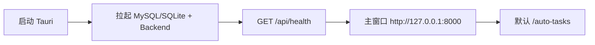

# Huoke 独立化技术迁移方案

> 日期：2026-06-17  
> 状态：方案定稿，待实施  
> 定位：将 `projects/huoke` 提取为完全独立产品，停止维护外层 `pc-acquisition-client` Native 方案

---

## 一、背景与决策

### 1.1 现状

当前获客能力分布在两套体系中：

| 体系 | 路径 | 技术栈 | 问题 |
|------|------|--------|------|
| 外层 Native | `code/pc-acquisition-client` | Electron + React + Sidecar zip | 与 Huoke 双维护，字段/能力易分裂 |
| Huoke 本体 | `projects/huoke` | Tauri + Vue3 + FastAPI | 后端完整，前端偏开发者工具，默认嵌云端 Portal |

Tauri 壳当前启动后默认进入 **Portal 模式**（嵌入 `tanjiyunai.com`），本地 H5 需手动切换：

- `desktop/src-tauri/src/lib.rs`：`set_shell_mode(..., ShellMode::Portal)`
- `PORTAL_URL = "https://www.tanjiyunai.com/customer/platform-bindings?huoke_embed=1"`

### 1.2 战略决策（已定）

| 项 | 决策 |
|----|------|
| 外层 Native | **停止维护**（`pc-acquisition-client` 归档，不再发版） |
| Huoke | **提取为独立 Git 仓库**，自成产品 |
| 云端 | **第一阶段完全断开**（不注册设备、不心跳、不嵌外链 H5） |
| UI | **全部在 `frontend/` H5 实现**，Native 只做壳 + 拉起本地后端 |
| 默认首页 | **本地 H5**（`/auto-tasks`），不再默认 Portal |
| 发版 | 统一走 Huoke 目录下 **Tauri 一体打包**，不走 `build-pc-client.sh` |

---

## 二、目标架构

### 2.1 运行链路

```text
Tauri Window
  → http://127.0.0.1:8000（本机 FastAPI 同源托管）
    → Vue3 Frontend（静态 dist）
    → Huoke Backend API（/api/*）
      → SQLite / 本地 storage
      → Playwright + 系统 Chrome（平台登录与抓取）
```



### 2.2 壳层职责（极简）

Native 壳**只做**：

- 启动 / 停止本地 backend（及可选 MySQL）
- 单 WebView 加载 `127.0.0.1:8000`
- 可选：系统托盘、开机自启、日志目录

Native 壳**不做**：

- 业务逻辑
- 云端通信（设备注册、心跳、JWT 鉴权）
- Portal / 外链 H5 嵌入与切换

### 2.3 独立仓库目录结构

提取后建议根目录：

```text
huoke/                          # 独立 Git 仓库
├── backend/                    # FastAPI + Playwright + Skill
├── frontend/                   # Vue3 + Element Plus（全部获客 UI）
├── desktop/                    # Tauri 2 原生壳
├── scripts/
│   ├── build_native_mac.sh
│   ├── build_native_win.ps1    # 待补全
│   ├── desktop-dev.sh
│   ├── desktop-prebuild.sh
│   └── windows/install-sidecar.ps1
├── docs/
├── docker-compose.local.yml    # 可选：开发用 MySQL
├── package.json                # 根版本号（独立产品版本）
├── .env.example
└── README.md
```

---

## 三、与主仓库解耦清单

提取独立仓库时，必须切断以下耦合：

| 耦合点 | 当前位置 | 改造 |
|--------|----------|------|
| Sidecar 版本号 | `scripts/windows/install-sidecar.ps1` 读 `code/pc-acquisition-client/package.json` | 改读本仓库根 `package.json` |
| 验证脚本文档 | `scripts/verify-huoke-standalone.sh` 提及 `dev-with-huoke.sh` | 改为 huoke 自有 dev 脚本 |
| Portal 云端 URL | `desktop/src-tauri/src/lib.rs` | 删除 Portal 相关逻辑 |
| 云端 postMessage | `frontend/src/utils/portalShell.js` | 删除 |
| 壳层底部切换栏 | `frontend/public/shell-footer.html` | 删除 |
| 设备注册/心跳 | `pc-acquisition-client` 的 `registerDevice` / `heartbeat` | Huoke 独立版不实现 |

历史 commit 保留建议：使用 `git filter-repo` 将 `projects/huoke/` 子目录提取为新仓库并保留历史。

---

## 四、壳层改造（去云端嵌入）

### 4.1 需删除 / 废弃的组件

| 文件 / 模块 | 原因 |
|-------------|------|
| `desktop/src-tauri/src/lib.rs` 中 `Portal` 窗口、`ShellMode` 切换 | 不再嵌云端 H5 |
| `frontend/public/shell-footer.html` | Portal/App 底部切换栏 |
| `frontend/src/utils/portalShell.js` | 云端 postMessage 协议 |
| `frontend/src/components/AppShell.vue` | 云端壳层 UI（若仅用于 Portal） |
| Tauri IPC：`shell_open_portal`、`shell_get_mode` 等 | 无 Portal 可切 |

### 4.2 Tauri 改造要点

**当前（需改）：**

```rust
// desktop/src-tauri/src/lib.rs
const PORTAL_URL: &str = "https://www.tanjiyunai.com/customer/platform-bindings?huoke_embed=1";
set_shell_mode(app, &*app.state::<ShellState>(), ShellMode::Portal)?;
```

**目标：**

- 启动 `bootstrap()` 后，主窗口直接 `navigate` 到 `http://127.0.0.1:8000/auto-tasks`
- 删除 `portal` 子窗口、`shell-footer` 子窗口及相关几何同步逻辑
- `tauri.conf.json` 中 `devUrl` / 主窗口 `url` 保持 `http://127.0.0.1:8000`

### 4.3 本地开发启动

```bash
# 终端 1：MySQL + 后端（desktop 模式托管前端静态文件）
./scripts/desktop-dev.sh

# 终端 2：Tauri 开发窗口
cd desktop && npm install && npm run dev
```

打包：

```bash
./scripts/build_native_mac.sh
# Windows：./scripts/build_native_win.ps1（待补全）
```

---

## 五、H5 层：外层获客 UI 迁入

### 5.1 目标侧栏（商家后台风格）

对齐原 `pc-acquisition-client`「AI 获客管理」分组：

```text
AI 获客管理
├── 自动获客        /auto-tasks
├── 手动获客        /manual-tasks
├── 账号设置        /account-settings
├── 大模型配置      /llm-settings
└── 评论/私信预设    /presets
```

开发者向页面（`/agent`、`/external-api`、`/antibot`）保留但默认隐藏，可通过 `VITE_DEV_MENU=1` 或设置开关启用。

### 5.2 页面与 Huoke 现状映射

| 外层菜单（pc-client） | Huoke 现状 | 动作 |
|----------------------|------------|------|
| 自动获客 | `/tasks` 任务编排 + `openPipeline` API | **新建** `/auto-tasks`，对接 Pipeline |
| 手动获客 | 后端 `manual_acquisition_service.py`，前端无专用页 | **新建** `/manual-tasks` |
| 账号设置 | `/login` + `/settings/account` | **合并重构** `/account-settings` |
| 大模型配置 | `/settings/model` + `settings_routes.py` | **独立菜单** `/llm-settings` |
| 评论/私信预设 | 后端有 outreach 逻辑，前端无预设页 | **新建** `/presets` |

### 5.3 侧栏改造

改造 `frontend/src/components/MainLayout.vue`：

- 从开发者风格（智能体助手、AntiBot、API 文档）改为商家后台风格
- 参考 `pc-acquisition-client/src/components/AppLayout.tsx` 的紫色侧栏 + 绿色高亮
- 默认路由从 `/agent` 改为 `/auto-tasks`（`router/index.js`）

### 5.4 路由规划（目标）

```javascript
// frontend/src/router/index.js（目标结构摘要）
{ path: "", redirect: "/auto-tasks" },
{ path: "auto-tasks", component: AutoTasksView },
{ path: "manual-tasks", component: ManualTasksView },
{ path: "account-settings", component: AccountSettingsView },
{ path: "llm-settings", component: LlmSettingsView },
{ path: "presets", component: PresetsView },
// 开发者菜单（可选隐藏）
{ path: "agent", component: AgentChatView },
{ path: "tasks", component: TaskListView },
{ path: "crawl-data", component: CrawlDataView },
```

---

## 六、本地 API 对接（不连云端）

所有页面只调本地 `http://127.0.0.1:8000/api/*`。`frontend/src/api/http.js` 已支持同源 `/api`，无需改 baseURL 逻辑。

租户 / 账号固定本地默认值：

- `tenant_id = default`
- `account_id = default`
- `X-Bridge-Secret = dev-bridge-secret`（仅 compat 层需要时）

### 6.1 核心接口映射

| 页面 | 本地 API |
|------|----------|
| 自动获客 | `POST /api/agent/pipeline/keyword-video-comments` |
| 任务进度 | `GET /api/agent/jobs/{job_id}` |
| 手动获客 | `POST /api/agent/tasks`（external task + manual brief） |
| 账号设置 | `GET /api/accounts/{id}/platforms/{platform}/login-status` |
| 触发登录 | `POST /api/accounts/{id}/platforms/{platform}/server-login` |
| 大模型配置 | `GET /api/settings/llm`、`PUT /api/settings/llm` |
| 评论/私信预设 | 待补 `GET/PUT /api/settings/presets`（或复用 task_config） |
| 抓取数据 | `GET /api/platforms/{platform}/contents` |
| 内容详情 | `GET /api/platforms/{platform}/contents/{content_id}` |
| 健康检查 | `GET /api/health` |

### 6.2 自动获客字段对齐（与 pc-client / Huoke 后端）

| Huoke 接口字段 | PC 任务字段 | 备注 |
|---------------|------------|------|
| `keyword` | `config.keywords[0]` | 多关键词逐个调用 |
| `platforms` | `[platform]` | 单平台 |
| `video_limit` | `min(requested_target/10, 20)` | huoke 上限 20 |
| `days` | `config.comment_days \|\| 3` | 评论天数 |
| `video_publish_days` | `publish_time` 映射 | unlimited→365, 1d→1, 3d→3, 7d→7 |
| `region` | `region_name` | 支持中文地区名 |

### 6.3 预设 API 缺口

后端已有 outreach 相关逻辑（`task_config_update_service`、`supervisor_outreach` 等），但缺少面向商家的预设 CRUD 接口。建议：

1. **Phase 2 短期**：`storage/tenants/default/presets.json` 本地读写
2. **Phase 3**：补 `GET/PUT /api/settings/presets` REST 接口

---

## 七、与 pc-acquisition-client 的废弃边界

| 模块 | 处置 |
|------|------|
| `electron/huoke-sidecar.js` | 废弃，sidecar 由 Tauri 直接托管 |
| `electron/local-acquisition-worker.js` | 废弃，任务执行走 huoke backend |
| `electron/huoke-direct.js` | 逻辑迁入 frontend API 层，直连本地 `/api` |
| `src/pages/leads/*` React 页面 | 参考 UI/字段，逻辑迁入 huoke Vue |
| `src/components/CreateAutoTaskModal.tsx` 等 | 复用字段映射表，代码不搬 |
| `scripts/build-pc-client.sh` | 不再用于获客发版 |
| `registerDevice` / `heartbeat` | Huoke 独立版删除 |
| Electron 三层热更（壳 + renderer zip + sidecar zip） | 不适用；Tauri 一体打包 |

---

## 八、分阶段实施计划

### Phase 0：独立仓库准备（1–2 天）

- [ ] 从 monorepo 提取 `projects/huoke/` 为新仓库
- [ ] 根目录添加 `package.json` 统一版本号
- [ ] 切断 `install-sidecar.ps1` 对 `pc-acquisition-client` 的引用
- [ ] 更新 README：独立产品，不依赖主仓库
- [ ] `git filter-repo` 保留子目录历史（可选）

### Phase 1：壳层去云端（1 天）

- [ ] Tauri 默认加载本地 H5，删除 Portal 相关代码
- [ ] 删除 `shell-footer.html`、`portalShell.js`
- [ ] 启动后直达 `/auto-tasks`
- [ ] 验证：`desktop-dev.sh` + `npm run dev` 可正常打开本地页

### Phase 2：H5 五页 + 侧栏（5–7 天）

- [ ] 重做 `MainLayout.vue` 侧栏（商家后台风格）
- [ ] 实现 `/auto-tasks`、`/manual-tasks`、`/account-settings`、`/llm-settings`、`/presets`
- [ ] 从 pc-client 复用字段映射与交互逻辑
- [ ] 默认路由改为 `/auto-tasks`

### Phase 3：本地闭环验收（2 天）

- [ ] 扩展 `verify-huoke-standalone.sh`（增加 UI 流程检查项）
- [ ] 验收：绑定账号 → 创建自动任务 → 查看抓取数据 → 配置 LLM → 预设
- [ ] 确认全程无云端请求（抓包或日志）

### Phase 4：打包发版（2–3 天）

- [ ] Mac `.dmg` 出包验证
- [ ] Windows：`install-sidecar.ps1` + Tauri build 联调
- [ ] 编写独立发版 SOP（不依赖 `build-pc-client.sh`）

---

## 九、验收标准

### 9.1 功能验收

| 场景 | 预期 |
|------|------|
| 首次启动 | 直接进入本地 `/auto-tasks`，无云端页面 |
| 账号绑定 | 抖音/小红书扫码登录成功，cookie 持久化 |
| 自动获客 | 创建任务 → Pipeline 执行 → 任务列表可见状态 |
| 手动获客 | 输入视频/主页 URL → 任务创建并执行 |
| 大模型配置 | 保存 API Key / 模型名，重启后仍生效 |
| 预设 | 评论/私信模板可编辑并用于任务 |
| 离线 | 断网状态下除平台扫码外均可操作 |

### 9.2 技术验收

```bash
# Sidecar / 后端健康
bash scripts/verify-huoke-standalone.sh

# 前端构建
cd frontend && npm run build

# 桌面打包
./scripts/build_native_mac.sh
```

### 9.3 禁止项

- 启动后默认打开 `tanjiyunai.com` 或任何外链 H5
- 依赖 `pc-acquisition-client` 的 IPC / sidecar zip 热更
- 任务创建走云端 `pc-worker/*` 接口

---

## 十、风险与应对

| 风险 | 应对 |
|------|------|
| Huoke 前端偏开发者 UI，与商家后台差距大 | 优先做侧栏 + 5 个核心页，不先动 `/agent` |
| 预设/话术后端 API 不全 | Phase 2 先用本地 JSON，Phase 3 补 REST |
| Windows 打包链路不如 Mac 成熟 | 以 `install-sidecar.ps1` 为基础补 `build_native_win.ps1` |
| 提取仓库后 monorepo 内引用断裂 | 主仓库 README 注明 huoke 已迁出，删除或归档 `projects/huoke` |
| 双维护期间字段不一致 | 以 Huoke backend schema 为唯一真相源，pc-client 不再改 |

---

## 十一、相关文档

| 文档 | 说明 |
|------|------|
| `README.md` | Huoke 本地开发与打包 |
| `docs/technical/dedicated-agent-architecture.md` | 任务智能体与 Skill 架构 |
| `docs/technical/agent-job-sync-contract.md` | Job 同步契约 |
| `code/pc-acquisition-client/docs/huoke-direct/DESIGN.md` | 历史：pc-client × Huoke 直连（归档参考） |

---

## 十二、变更记录

| 日期 | 说明 |
|------|------|
| 2026-06-17 | 初版：独立化战略、壳层去云端、H5 迁入、分阶段计划 |
| 2026-06-17 | 实施：Tauri 去 Portal、5 个获客页面、预设 API、商家侧栏 |
